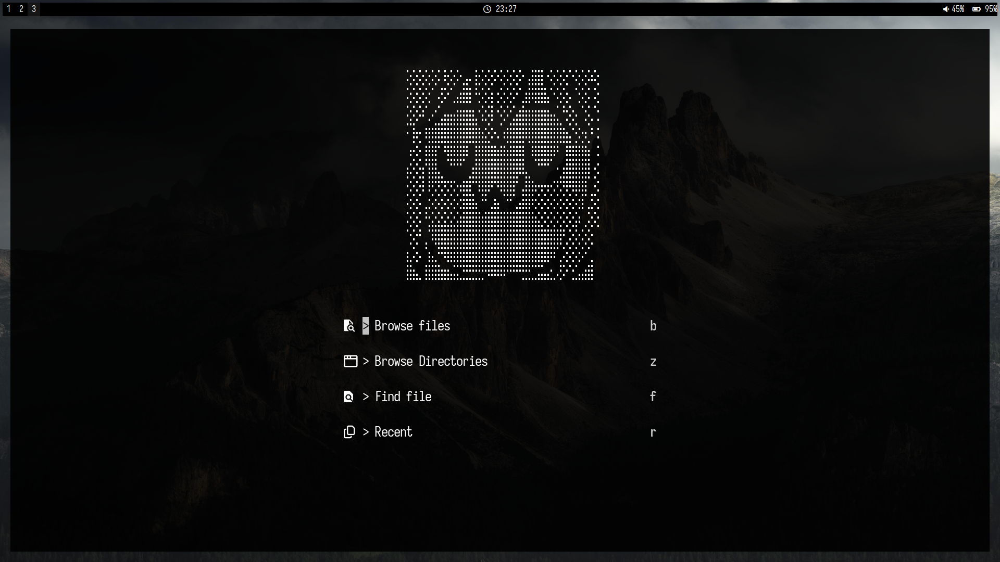

# My NeoVim Configuration

A minimal, boring with minimal fluff.

## Installation

> ⚠️ Requires Neovim 0.11.2 or higher
```sh
git clone https://github.com/VoktraBtw/nvflux.git
mv nvflux ~/.config/nvim && nvim
```

## Screenshots




> Inspired by [@vimichael](https://github.com/vimichael)

